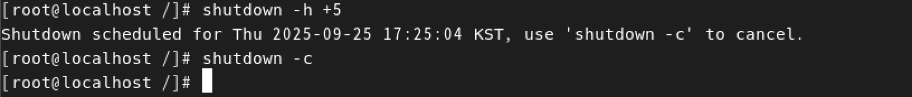
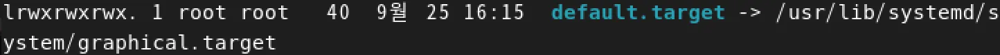
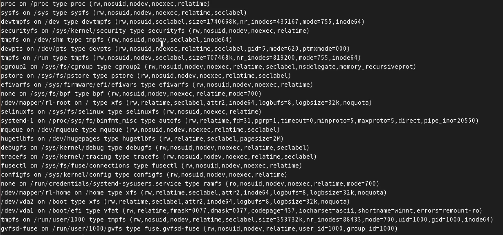

# Linux 기초 명령어 정리

## 📌 12강 – 시스템 종료 & 사용자 전환

```bash
shutdown -h +5   # 지금으로부터 5분 후 시스템 종료
shutdown -c      # 예약된 shutdown 취소

Ctrl + Alt + F4  # 사용자 전환 가능 (가상 콘솔 이동)
```

## 📌 13강 – 시스템 런레벨 변경

기본적으로 런레벨 5(그래픽 모드)로 부팅됨.
```bash
ls -l /etc/systemd/system/default.target   # 현재 기본 타겟 확인
ln -sf /usr/lib/systemd/system/multi-user.target /etc/systemd/system/default.target
# 런레벨을 multi-user(텍스트 모드)로 변경
```


## 📌 14강 – Vi Editor 기본

- 문자열 찾기 → /문자열 (예: /CDROM)

- 이동

    - k : 위로 이동

    - j : 아래로 이동

- 편집 모드

    - i : 입력 모드 (텍스트 입력 가능)

    - Esc : 명령 모드로 복귀

    - :wq : 저장 후 종료

## 📌 15강 – 마운트 & 언마운트

CD/DVD → USB 등 장치를 디렉토리에 연결하여 사용.
```bash
# VM에 CD/DVD/USB를 연결한것을 가정
mount                        # 현재 마운트된 장치 확인
umount /dev/cdrom            # 장치 언마운트

mkdir /media/cdrom           # 마운트 포인트 생성
mount /dev/cdrom /media/cdrom  # CD-ROM 마운트
cd /media/cdrom
#해당 디렉토리에 파일 추가하면 장치에도 자동으로 추가

```



## 📌 16강 – 리눅스 기본 명령어
```bash
ls -al             # 상세 리스트
cd                 # 디렉토리 이동
pwd                # 현재 경로 확인
rm -rf file        # 파일/디렉토리 삭제
cp abc.txt cba.txt # 파일 복사
mv                 # 파일/디렉토리 이동 또는 이름 변경
touch file.txt     # 빈 파일 생성
mkdir abc          # 디렉토리 생성
rmdir abc          # 디렉토리 삭제 (비어있을 경우만)
cat file.txt       # 파일 내용 출력
head -3 file.txt   # 파일의 처음 3줄 출력
tail -3 file.txt   # 파일의 마지막 3줄 출력
more file.txt      # 페이지 단위 출력 (앞으로만 이동)
less file.txt      # 페이지 단위 출력 (앞뒤 이동 가능, 권장)
file file.txt      # 파일 타입 확인
clear              # 화면 정리

```