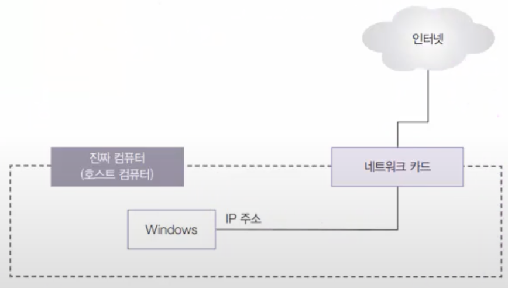
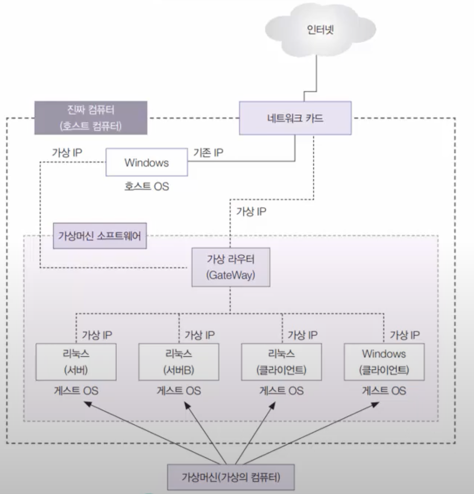
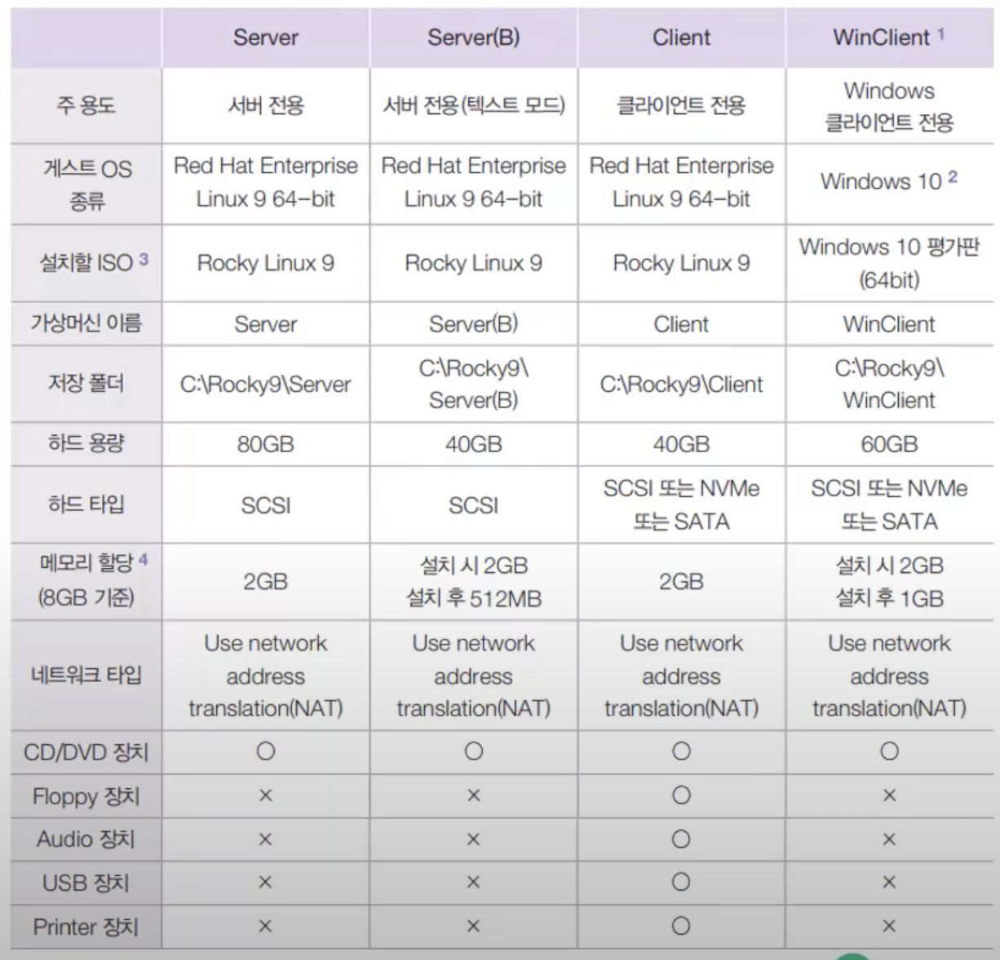

# [1강. VM 개념 및 실습 환경 구축]

### 컴퓨터에 설치된 운영체제(=호스트 OS) 안에 가상의 컴퓨터를 만들고, 그 안에 또 다른 운영체제(게스트OS)를 설치 및 운영할 수 있도록 함
*// 멀티부팅(Multi-Booting)과는 개념 상이*

---

## 실습환경 구축 - Mac M1 기준

1. 사전에 미리 "VMware Fusion 13.6.4"과 "Rocky-9.6-aarch64-dvd.iso"를 설치
#### 기존에는 Rocky-9.0-aarch64-dvd.iso으로 사용하려고 했으나 계속 "Install Rocky Linux 9.0" 다음 단계에서 멈추는 현상이 발생하여 최신 9.6 버전 사용

2. 새 VM 생성
#### 실습 환경에서 사용할 VM 스펙

