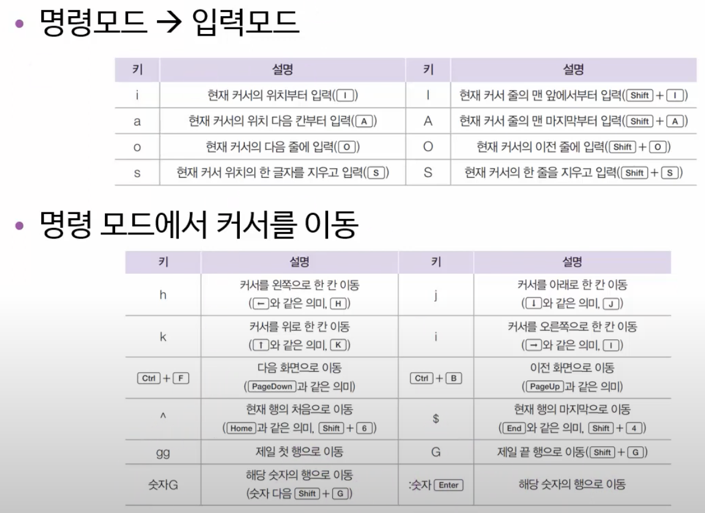

# [4장. 서버를 구축하는 데 알아야 할 필수 개념과 명령]

## [리눅스 시스템 시작 및 종료 방법]

### `<종료 방법>`
* 바탕화면의 ‘오른쪽 위 전원 버튼’을 통해 '컴퓨터 끄기/로그아웃' 후 '컴퓨터 끄기'를 선택하여 종료
* 터미널에서 `shutdown -P now`, `halt -p`, `init 0` 명령으로 시스템을 종료 가능

### `<재부팅 방법>`
* 바탕화면의 ‘오른쪽 위 전원 버튼’을 통해 ’컴퓨터 끄기/로그아웃' 후 ’다시 시작' 선택
* `shutdown -r now`, `reboot`, `init 6` 명령으로 재부팅 가능

### `<로그아웃 방법>`
* 바탕화면의 ‘오른쪽 위 전원 버튼’을 통해 '컴퓨터 끄기/로그아웃' 후 ‘로그아웃’ 선택
* `logout`, `exit` 명령으로 가능

---

## [런 레벨]
*// 런레벨은 init 명령어 뒤에 붙는 숫자를 의미*
* `init 0` : 컴퓨터 종료 (Power Off)
* `init 1` : 시스템 복구
* `init 6` : 재부팅 (Reboot)
* 런레벨 2, 3, 4번은 텍스트 모드 부팅을 의미하며, 주로 3번 사용
* 일반적인 X 윈도우 모드는 런레벨 5번
* 런레벨 파일들은 `/LIB/SYSTEMD/SYSTEM` 폴더 아래 `런레벨0.target`부터 `런레벨6.target`까지 존재하며, 이들은 실제 파일이 아닌 링크 파일

---

## [자동 완성과 히스토리]
* **자동 완성** : 파일명이나 디렉터리명의 일부를 입력하고 `Tab` 키를 누르면 자동으로 완성되는 편리한 기능
* **도스 키** : 화살표 위/아래 키를 눌러 이전에 입력했던 명령어를 다시 불러오는 기능
* **히스토리** : 이전 명령어 목록을 확인할 수 있으며, `history -c`로 목록을 지울 수 있음

---

## [에디터]
* **gedit** : X 윈도우 환경에서 메모장처럼 사용 가능
* **nano** : 텍스트 모드에서도 사용 가능
* **vi** : 모든 유닉스/리눅스 시스템에서 기본적으로 제공되므로 필수적으로 익히길 권장

### `<gedit>`
* `gedit`
    * 내용 작성 후 저장(S) 버튼 클릭하여 원하는 위치에 저장 
* `gedit 파일명`
    * 내용 작성 후 저장(S) 버튼 클릭

### `<nano>`
* `nano`
    * 내용 작성 후 나가기(`Control + X`) 및 내용 저장(`Y`) -> 파일명입력 -> `Enter`
* `nano 파일명`
    * 이전에 작성했던 파일 내용 확인 가능 -> 내용 수정 후 나가기(`Control + X`) 및 내용 저장(`Y`) -> `Enter`
* `nano -c 파일명`
    * 자동 행 번호 표시 옵션 추가

### `<vi>`
#### vi 기능요약

*// (커서 이동은 이제 잘 안 씀, 옛날에는 방향키가 없어서 그럼)*

* **vi 파일명**
    * 명령모드 -> `i` or `a`(Insert:입력 모드 활성화) -> 내용 작성 가능 -> `esc`(ex 모드 활성화) -> `:wq`(저장 후 종료)
* **vi**
    * `i` or `a`(Insert:입력 모드 활성화) -> 내용 작성 가능 -> `esc`(ex 모드 활성화) -> `:w 파일명` -> 파일명 생성 -> `:q`(종료)
    * *//or :wq 파일명 -> 파일명 생성 및 종료*

#### //비정상 종료(변경하지 않고 종료)
* `i` or `a`(Insert:입력 모드 활성화) -> 내용 작성 가능 -> `esc`(ex 모드 활성화) -> `:q!`(저장하지 않고 종료)
    * *# :q와 다른 점 - :q는 수정하지 않은 상태에서만 사용 가능*

#### // 만약 비정상 종료가 되었다면 해당 파일 삭제 후 진행
* `rm -f .파일명.swp`

---

## [마운트 및 CD/DVD 및 USB 메모리 활용]
### 마운트 : 물리적인 장치를 특정한 위치 (대개는 디렉터리)에 연결시켜 주는 과정
*// 리눅스는 장치와 연결이 안 되는 게 기본이기 때문에 따로 연결을 해줘야 함*

### `<cd, dvd를 연결>`
#### 서버 가상머신
* `mount` : 마운트된 장치 목록을 보여줌
* `dev/sda2` : 루트 파티션, 자동으로 이곳에 마운트 됨
* 마운트하기 전에 이미 되어있는지 확인 후 진행
* `unmount /dev/cdrom` : 연결을 끊음
* Removable Device → CD/DVD → Setting
* Device status → Connected, Connect at power on 체크, ISO 입력 → 마운트가 자동으로 됨
    * `/dev/sr0 on /run/media/root/Rocky-9-0-x86_64-dvd`
* `cd /run/media/root/Rocky-9-0-x86_64-dvd` 로 이동하면 연결 확인 가능 
* 여기에 dvd에 필요한 파일을 넣어주면 됨
* `unmount /dev/cdrom` 다시 하면 오류가 뜸 ← dvd 파일 밖에서 진행하면 됨

### `<USB 연결>`
#### 클라이언트 가상머신
* 주의 - USB가 NTFS로 되어있으면 리눅스가 인정을 못 함 → 포맷 → FAT32로 진행
* USB → Connect (PC에서 가상머신으로 USB가 이동)
* `cd /run/media/rocky/USB1` ← 파일 확인 가능
* `cp /boot/config-5.14.0-70.13.1.el9_0.x86_64` 파일 복사
* USB 제거하면 다시 PC로 이동

### `<텍스트 모드만 있는 서버B에서 dvd, USB 사용>`
*// 텍스트모드는 직접 연결을 해야 함*
#### dvd 연결
* `ls /media` → `mkdir /media/cdrom` → `mount /dev/cdrom /media/cdrom`
* `cd /media/cdrom` 해서 아까 확인한 파일 확인 가능
#### USB 연결
* `mkdir /media/usb` → `mount /dev/sdb1 /media/usb`
* `cd /media/usb` 해서 아까 확인한 파일 확인 가능

## [리눅스 기본 명령어]
* ls : 해당 디렉터리에 있는 파일의 목록을 나열
* ls 파일경로 : 해당 파일 경로에 있는 파일의 목록을 나열
* ls -l : 더 자세하게 볼 수 있음, ls -a : 숨김 파일 확인 가능
* cd : 디렉터리 이동
* cd .. : 상위 디렉터리로 이동
* pwd : 현재 디렉터리 경로 출력
* rm : 파일이나 디렉터리 삭제 (폴더 안에 파일이 있으면 해당 폴더 삭제가 안 됨)
* rm -f 파일이름 : 강제로 파일이나 디렉터리 삭제
* cp : 파일이나 디렉터리 복사
* cp -r 디렉터리이름 : 디렉터리를 통으로 복사
* touch : 크기가 0인 새 파일 생성, 이미 존재하는 경우 수정시간 변경
* mv : 파일과 디렉터리 이름을 변경하거나 위치 이동
* mkdir : 새로운 디렉터리 생성
* rmdir : 디렉터리 삭제 (비어있어야 함)
* cat : 텍스트로 작성된 파일을 화면에 출력
* head, tail : 텍스트로 작성된 파일의 앞 10행 또는 뒤 10행 출력
* more : 텍스트로 작성된 파일을 화면에 페이지 단위로 출력
* less : more와 용도가 비슷하지만 기능이 더 확장됨
* file : 파일이 어떤 종류의 파일인지 표시
* clear : 명령창을 깨끗하게 지워줌